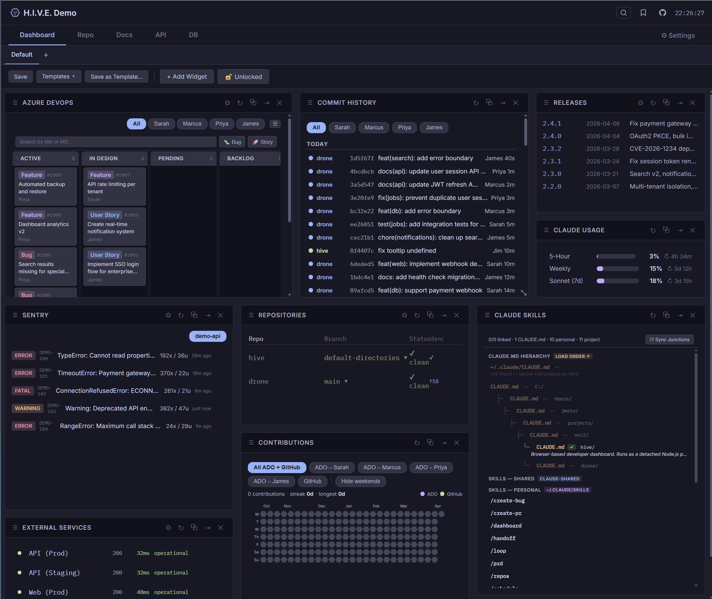

# H.I.V.E.
### Hub for Integrated Visualization & Exploration

> A self-hosted developer dashboard that lives in your browser and knows everything about your stack — git status, live logs, external service health, SQL metrics, API collections, and more. Zero cloud. Zero accounts. Just `npm start`.



---

## TL;DR — Install Order

| Step | Repo | What it does |
|------|------|---|
| 1 | **H.I.V.E.** (this repo) | Clone → `./setup.sh` → configures your identity, provider, dashboard, and writes shared config |
| 2 | **Drone** (optional) | Clone → `npm start` — auto-configures HIVE on startup |
| 3 | **[Hivemind](https://github.com/Montra-Solutions/hivemind)** | Fork → `./setup.sh` → detects existing config, installs Claude Code skills, creates platform CLAUDE.md |

Each repo works independently. All three together is the full experience.

**Just want to kick the tires?** Clone both repos and run one setup command — see the [one-liner setup](#one-liner-setup).

---

## What is H.I.V.E.?

H.I.V.E. is a single-page dashboard you run locally alongside your dev environment. It's not a SaaS product, not a hosted service, and not a browser extension. It's a Node.js server you own completely — your config, your queries, your data, all staying on your machine.

It's designed for developers who want one tab that tells them everything:

- Is my API running? What's it logging right now?
- Which repos have uncommitted changes? 
- Which branch am I on?
- Did production just go down?
- What does the open ticket count look like this week?
- What's in this database table?

You configure it once, and it stays out of your way.

---

## Features

### Git Status
Live status for every repo in your projects directory — current branch, dirty file count, ahead/behind tracking. Refreshes automatically every 5 seconds. Click any repo to open it in your editor or run quick git actions without leaving the browser.

### Service Log Streaming
Tail your Web and API dev server logs in real time via Socket.IO. Logs scroll live, ANSI colours preserved. The dashboard reads from log files written by your start scripts — no process coupling, no teardown risk.

### External Service Monitors
Configure HTTP health checks for any URL — your production app, staging, third-party APIs, status pages. Monitors run on a 30-second interval. When something goes down, an alarm sounds (mutable per-service). Status history is tracked in-session.

### SQL Metric Widgets
The **Metric Creator** lets you write custom SELECT queries against any configured PostgreSQL connection and visualise the results as dashboard widgets:

| Widget Type | Best For |
|---|---|
| **Number Metric** | Single scalar value (e.g. open ticket count) |
| **Delta Metric** | Value + trend vs previous period |
| **Table List** | Multi-row results |
| **Key/Value Card** | Single row, multiple columns |
| **Bar Chart** | Two-column label + value |
| **Status Badges** | Enum or boolean columns |
| **Gauge** | Value as a percentage of a max |

Only SELECT statements are allowed — INSERT/UPDATE/DELETE/DROP are blocked server-side.

### Database Explorer
Browse your PostgreSQL databases directly in the dashboard — list schemas, tables, and run ad-hoc queries with a syntax-highlighted editor.

### API Collections
A lightweight HTTP client built into the dashboard. Save requests as collections, set environment variables per environment (local/dev/prod), and run them without leaving the browser.

### Docs Viewer
Render markdown documentation from any directory in your project. Browse your repo's docs, ADRs, or Obsidian vault without leaving the dashboard.

### ADO & GitHub Integration
Pull request lists, work item boards, and contribution graphs — all configurable via the Settings UI. Requires an ADO PAT or GitHub token set as an environment variable.

### Sentry Integration
Live error feed from your Sentry projects. Unresolved issues, occurrence counts, and direct links — surface production errors right in your dev flow.

### Widget Grid
Every widget is draggable and resizable. Save your layout. Switch between saved layouts. The grid state persists across sessions.

---

## Requirements

- **Node.js** 18 or later
- **Git** (for repo status features)
- **PostgreSQL** (optional — only needed for SQL metric widgets and DB explorer)

---

## Getting Started

### 1. Clone the repo

```bash
git clone https://github.com/Montra-Solutions/hive.git
cd hive
npm install
```

### 2. Run setup

Setup is an interactive CLI that generates all your config files. It's safe to re-run at any time to update your config.

**macOS / Linux:**
```bash
./setup.sh
```

**Windows (PowerShell):**
```powershell
.\setup.ps1
```

Setup begins by asking you to choose a mode:

| Mode | When to use |
|---|---|
| **[1] Full setup** | You have repos, services, and integrations to configure |
| **[2] Demo mode** | You want to explore H.I.V.E. quickly — pair with Drone for the full experience |

#### Full setup

The full 10-step wizard asks for:

| Section | What it configures |
|---|---|
| **Identity** | Your name and email (pre-filled from git config) |
| **Provider** | ADO (Azure DevOps), GitHub, or skip |
| **ADO / GitHub** | Org, project, team, users, PR repos, reviewers |
| **Project** | Dashboard title, project name |
| **Projects directory** | Parent folder containing all your repos |
| **Repositories** | Which repos to monitor in the git status panel |
| **Services** | Your Web and API dev servers (ports, start commands) |
| **Database Connections** | PostgreSQL connection strings for the DB explorer and SQL widgets |

#### Demo mode

Demo mode skips the full wizard and writes a minimal config in seconds:

- Auto-detects your projects directory (parent of hive)
- Detects Drone as a sibling and runs `npm install` for both repos
- Skips identity, provider, services, and database questions
- Writes a working `dashboard.config.json` immediately

Clone both hive and drone first, then run setup once — see the [one-liner setup](#one-liner-setup).

---

Setup also writes a **shared config** at `~/.config/hivemind/config.md` that Hivemind skills consume — so you only configure identity and provider once.

Everything setup generates is **gitignored** — credentials and local paths never leave your machine.

### 3. Start the dashboard

```bash
npm start
```

Open **http://localhost:3333** in your browser.

> **Custom port:**
> ```bash
> # bash / zsh
> PORT=4000 npm start
>
> # PowerShell
> $env:PORT=4000; npm start
> ```

---

## What Setup Creates

| File | Purpose | Committed? |
|---|---|---|
| `dashboard.config.json` | Main config — repos, services, monitors, integrations | No |
| `data/databases.json` | PostgreSQL connection strings | No |
| `data/environments.json` | Environment variable sets for API collections | No |
| `data/collections.json` | Saved API request collections | No |
| `data/metrics.json` | Saved SQL metric widget definitions | No |
| `data/layouts.json` | Dashboard grid layouts (widget positions, named layouts) | No |
| `run-web.sh` / `run-web.ps1` | Script to launch your web dev server | No |
| `run-api.sh` / `run-api.ps1` | Script to launch your API dev server | No |
| `~/.config/hivemind/config.md` | Shared config for Hivemind skills (identity, provider) | No |
| `~/.config/hivemind/paths.env` | Directory paths for skill runtime | No |

All of the above are gitignored or outside the repo. The repo you cloned stays clean.

---

## Configuration

After setup, you can edit `dashboard.config.json` directly or use the **Settings** tab in the dashboard UI — changes save immediately without a restart.

### Key config fields

```jsonc
{
  // Dashboard display name
  "title": "My Project — H.I.V.E.",

  // Absolute path to the folder containing all your repos
  "projectsDir": "C:\\Users\\you\\Projects",

  // Repos to show in the git status panel (relative to projectsDir)
  "repos": ["hive", "my-api", "my-web", "my-db"],

  // Dev servers — port-checked for running status, Start button uses run-*.sh/ps1
  "services": {
    "web": { "label": "Web", "port": 8080, "startCmd": "npm run dev", "repoDir": "my-web" },
    "api": { "label": "API", "port": 3000, "startCmd": "npm run start:dev", "repoDir": "my-api" }
  },

  // HTTP monitors — checked every 30s, alarm on failure
  "externalMonitors": [
    { "key": "prod", "label": "Production", "url": "https://myapp.com", "type": "http" }
  ],

  // ADO integration (requires ADO_PAT env var)
  "ado": {
    "org": "my-org",
    "project": "My Project",
    "team": "My Team"
  },

  // GitHub integration (requires GITHUB_TOKEN env var)
  "github": {
    "org": "my-github-org"
  },

  // Sentry integration (requires SENTRY_AUTH_TOKEN env var)
  "sentry": {
    "org": "my-sentry-org",
    "projects": ["frontend", "backend"]
  }
}
```

See `dashboard.config.example.json` for the full reference with all available options.

### Environment variables (credentials)

Credentials are never stored in `dashboard.config.json`. Set them in a `.env` file in the hive directory (also gitignored):

```env
ADO_PAT=your-azure-devops-pat
GITHUB_TOKEN=your-github-token
SENTRY_AUTH_TOKEN=your-sentry-token
```

Or set them in your shell environment before running `npm start`.

---

## Service Log Streaming

H.I.V.E. tails log files — it does **not** manage your dev server processes. Your `run-web.sh` / `run-web.ps1` scripts redirect output to log files that the dashboard watches via `fs.watch`.

Generated by setup:
```bash
# run-web.sh (macOS/Linux)
cd /Users/you/Projects/my-web
npm run dev 2>&1 | tee ~/.hive/logs/web.log
```

You can also click **Start** on the Services widget in the dashboard — this opens a new terminal tab running the script automatically.

---

## SQL Metric Widgets

1. Open the **Metric Creator** from the widget picker (+ button)
2. Select a database connection or write inline SQL
3. Click **Preview** — the result shape is auto-detected and widget types are suggested
4. Choose a widget type, configure labels/thresholds/units
5. Click **Save** — the widget appears on your grid immediately

Saved metrics live in `data/metrics.json` (gitignored). Share query ideas with your team by pasting them in chat — the actual connection strings and data stay local.

---

## Demo Mode

Demo mode is the fastest way to see H.I.V.E. in action. It pairs with **Drone**, a companion repo that generates realistic dev activity (git commits, service health, error feeds, work items) so your dashboard looks alive without any real infrastructure.

### One-liner setup

Clone both repos, then run HIVE setup — it detects Drone and installs dependencies for both:

**macOS / Linux:**
```bash
git clone https://github.com/Montra-Solutions/hive.git && git clone https://github.com/Montra-Solutions/drone.git && cd hive && ./setup.sh
```

**Windows (PowerShell):**
```powershell
git clone https://github.com/Montra-Solutions/hive.git; git clone https://github.com/Montra-Solutions/drone.git; cd hive; .\setup.ps1
```

Choose **option [2] Demo mode** when prompted. Setup will:
1. Write a minimal `dashboard.config.json` with Drone included
2. Run `npm install` in both hive and drone
3. Print the exact commands to launch both services

### After setup — launch

Open two terminals from your projects directory:

```bash
# Terminal 1 — start HIVE
cd hive
npm start

# Terminal 2 — start Drone
cd drone
npm start
```

Drone auto-detects HIVE and configures it on startup — injecting mock API tokens and registering all demo services. If HIVE isn't running yet, drone retries every 5 seconds until it connects. Start order doesn't matter.

Open **http://localhost:3333** (dashboard) and **http://localhost:4000** (Drone control panel).

When you're ready for real configuration, re-run setup and choose **Full setup**.

---

## Health Check

Run `npm run doctor` to validate your setup:

```bash
npm run doctor
```

This checks:
- Config file exists and is valid
- Projects directory exists and repos are found
- Integration tokens are set (only warns for tokens your config actually uses)
- Drone and HIVE servers are reachable
- Database connections are configured
- Hivemind config and skills are installed

Use it after initial setup or whenever widgets aren't loading as expected.

---

## Troubleshooting

### Dashboard won't start — `dashboard.config.json not found`
Run setup: `./setup.sh` or `.\setup.ps1`. If you just want to explore, the server auto-creates one from the example file on first run.

### Port already in use
Another process is on port 3333. Either stop it or start H.I.V.E. on a different port:
```bash
# bash / zsh
PORT=4000 npm start

# PowerShell
$env:PORT=4000; npm start
```

### Git status shows wrong repos
Open **Settings → Repositories** in the dashboard. Add or remove repos and save — no restart required.

### Services show as not running but they are
Check that the `port` in your services config matches the actual port your dev server is listening on. The running check is a simple TCP connect on that port.

### ADO / GitHub / Sentry widgets show nothing
Make sure the relevant env var is set (`ADO_PAT`, `GITHUB_TOKEN`, `SENTRY_AUTH_TOKEN`) and that the org/project names in Settings match exactly.

---

## Better Together: Hivemind

H.I.V.E. pairs with **[Hivemind](https://github.com/Montra-Solutions/hivemind)** — a shared Claude Code configuration system that brings team-wide AI skills for PR creation, bug tracking, planning, and more.

H.I.V.E. setup writes the shared config that Hivemind skills consume — so install H.I.V.E. first, then Hivemind. When Hivemind runs its setup, it detects the existing config and skips identity/provider questions.

With Hivemind installed, you get the `/dashboard` skill which launches H.I.V.E. directly from Claude Code and manages service startup automatically.

Each works independently. Both installed is the full experience.

---

## Project Structure

```
{dev-project-a/}                # hive is expected to be a sibling 
{dev-project-n+1/}              # User projects as sibling folder  
hivemind/                       # (Optional - please fork the project) shared Claude Code configuration system
hive/                           # This project folder
├── server.mjs                  # Express + Socket.IO backend
├── public/
│   ├── index.html              # Single-page app shell
│   ├── app.js                  # Core app logic, grid, navigation
│   ├── db.js                   # Database explorer frontend
│   ├── docs.js                 # Docs viewer frontend
│   ├── settings.js             # Settings UI (reads/writes dashboard.config.json)
│   ├── repo.js                 # Repo detail panel
│   ├── search.js               # Global search
│   ├── swagger.js              # Swagger UI integration
│   ├── sentry-detail.js        # Sentry issue detail panel
│   ├── copilot.js              # AI assistant panel
│   └── widgets/                # One file per widget type
│       ├── shared.js           # WIDGET_REGISTRY, shared helpers
│       ├── git-status.js
│       ├── service-log.js
│       ├── external-services.js
│       ├── metric.js           # SQL metric widgets
│       └── ...
├── data/                       # Runtime data (all gitignored)
│   ├── databases.example.json  # Template for DB connections
│   ├── metrics.example.json    # Template for saved metrics
│   ├── layout.json             # Dashboard layout configuration
│   └── ...
├── dashboard.config.example.json  # Full config reference
├── setup.sh                    # macOS/Linux interactive setup
└── setup.ps1                   # Windows interactive setup
```

---

## Contributing

H.I.V.E. is intentionally simple — no bundler, no TypeScript, no framework. Widgets are vanilla JS files that register themselves on `window.WIDGET_REGISTRY`. Adding a new widget means adding one file to `public/widgets/` and one `<script>` tag to `index.html`.

See `CLAUDE.md` for the widget contract and architecture notes.

---

## License

MIT
